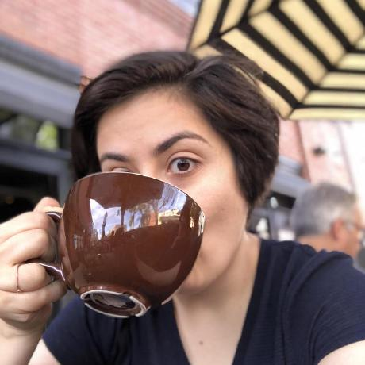

---
hide:
  - navigation
  - toc
---

# Negin Sobhani, Ph.D.

Machine Learning for Weather, Air Quality &amp; Climate Modeling 🌎 | Geospatial AI/ML &amp; Data Science | Bridging HPC, AI/ML, Weather &amp; Climate Modeling at NSF-NCAR

[:material-email: Email](mailto:negins@ucar.edu){ .hero-link }
[:fontawesome-brands-github: GitHub](https://github.com/negin513){ .hero-link }
[:fontawesome-brands-linkedin: LinkedIn](https://linkedin.com/in/neginsobhani){ .hero-link }
[:fontawesome-brands-google-scholar: Scholar](https://scholar.google.com/citations?hl=en&user=D9L61z8AAAAJ){ .hero-link }

---

## About me

I'm a computational scientist at the NSF National Center for Atmospheric Research (NSF-NCAR) in Boulder, Colorado. My work lives at the intersection of atmospheric science, HPC, and AI/ML.

Currently serving as the Technical Lead of the NSF-NCAR Community AI Ecosystem initiative, I coordinate eight labs and 50+ stakeholders to build unified geospatial AI/ML infrastructure for Earth system science.

My background spans numerical weather prediction, distributed GPU training, performance optimization on HPC/Cloud architectures, and building scalable data workflows for large geospatial datasets. I'm passionate about open science and fostering community-driven computational geoscience.

I'm an active open-source contributor and technical leader in the [Pangeo](https://pangeo.io/) ecosystem, serving as a core contributor to [Xarray](https://github.com/pydata/xarray), [CuPy-Xarray](https://github.com/xarray-contrib/cupy-xarray), and [Pythia](https://projectpythia.org/). I enjoy teaching and have delivered tutorials at [SciPy](https://www.scipy.org/), [ESDS](https://ncar.github.io/esds/), and NCAR on topics ranging from scalable geospatial data analysis to distributed AI/ML workflows.

I hold a Ph.D. in Chemical Engineering from the University of Iowa, where my research focused on atmospheric chemistry modeling, performance analysis, and optimization of weather and air quality models.

---

## Interests

Scientific Machine Learning
HPC & GPU Computing
Distributed Training
Weather & Climate Modeling
Scalable Geospatial Data
Open-Source Scientific Software
Performance Optimization
Pangeo Ecosystem

